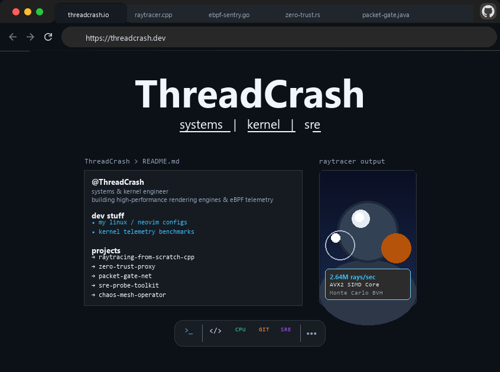

  <picture>
    <source media="(prefers-color-scheme: dark)" srcset="assets/readme-dark.png">
    <source media="(prefers-color-scheme: light)" srcset="assets/readme-light.png">
    
  </picture>

###### 👆 The above image is interactive! Try clicking on the tabs :)

### `ThreadCrash`
Systems and kernel engineer working on low-latency infrastructure, eBPF telemetry, and rendering engines.

#### Active Repositories
* [**raytracing-from-scratch-cpp**](https://github.com/ThreadCrash/raytracing-from-scratch-cpp) — Multithreaded Monte Carlo path tracer built in C++20 with BVH spatial acceleration, SIMD slab test, and glass refraction.
* [**zero-trust-proxy**](https://github.com/ThreadCrash/zero-trust-proxy) — High-performance L7 reverse proxy with eBPF sockmap bypass, SPIFFE attestation, and mTLS 1.3.
* [**packet-gate-net**](https://github.com/ThreadCrash/packet-gate-net) — Asynchronous zero-copy Netty packet gate and memory-pooled buffer pipeline for PaperMC / Velocity Minecraft servers.
* [**sre-probe-toolkit**](https://github.com/ThreadCrash/sre-probe-toolkit) — Low-overhead kernel telemetry probes, socket ring buffers, and eBPF tracepoints for SRE diagnostics.
* [**chaos-mesh-operator**](https://github.com/ThreadCrash/chaos-mesh-operator) — Kubernetes resilience controller for automated netem packet corruption and latency fault injection.
* [**falco-threat-rules**](https://github.com/ThreadCrash/falco-threat-rules) — Cloud-native container runtime threat detection rules mapped to MITRE ATT&CK matrix.

#### Notes & Environments
* Linux kernel telemetry & tracepoints
* Modern C++ (C++20), Go, Rust, Java (Netty / low-latency systems)
* Kubernetes, eBPF / XDP, WireGuard mesh
